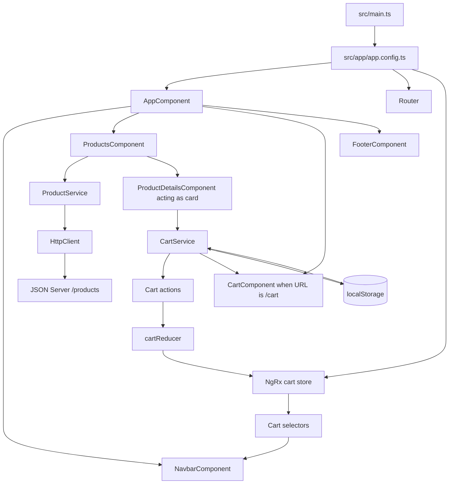

# SOLE//RAW Sneaker Store Architecture

This document explains the current Angular 18 application as it exists today. It describes implemented behavior and calls out features that are only placeholders or are not implemented.

## 1. How The App Starts

Startup flow:

```text
src/index.html
	-> src/main.ts
	-> bootstrapApplication(AppComponent, appConfig)
	-> src/app/app.config.ts providers
	-> AppComponent
	-> Navbar + storefront components or CartComponent + Footer
```

`src/main.ts` bootstraps the standalone `AppComponent`:

```ts
bootstrapApplication(AppComponent, appConfig)
	.catch((err) => console.error(err));
```

`src/app/app.config.ts` registers:

- `provideZoneChangeDetection`
- `provideRouter(routes)`
- `provideHttpClient()`
- `provideStore({ cart: cartReducer })`

`src/app/app.component.html` always renders the navbar and footer. It renders the storefront unless the current URL starts with `/cart`, in which case it renders the cart.

## 2. How Routing Works

The only configured route is in `src/app/app.routes.ts`:

```ts
export const routes: Routes = [
	{ path: 'cart', component: CartComponent }
];
```

The navbar uses:

```html
routerLink="/cart"
```

Important current behavior: `RouterOutlet` is imported by `AppComponent`, but `<router-outlet>` is not present in the root template. Instead, `AppComponent.isCartRoute()` checks `router.url` and manually renders `<app-cart>`.

There are currently no routes for home, products, product details, login, register, checkout, or a wildcard page. There are no lazy routes, child routes, route parameters, or guards.

## 3. How Products Are Fetched

Product data is stored in `db.json` and served by JSON Server:

```text
GET http://localhost:3000/products
```

Flow:

```text
ProductsComponent.ngOnInit()
	-> ProductService.getProducts()
	-> HttpClient.get<Products[]>()
	-> JSON Server
	-> Observable emits Products[]
	-> ProductsComponent.products
	-> @for renders cards
```

Files involved:

- `src/app/core/models/product.model.ts`
- `src/app/core/service/product.service.ts`
- `src/app/features/products/products.component.ts`
- `src/app/features/products/products.component.html`
- `db.json`

The API response has a top-level `products` collection, which JSON Server exposes as the `/products` array. The current `db.json` contains duplicate product IDs, which is a problem because templates track products by `product.id`.

## 4. How ProductCard Works

There is no component named `ProductCardComponent` in the current project.

The current product card is `ProductDetailsComponent`, located at:

```text
src/app/features/product-details/product-details.component.ts
```

`ProductsComponent` imports it and passes a complete product:

```html
@for (product of products; track product.id) {
	<app-product-details [product]="product"></app-product-details>
}
```

The component receives the data through:

```ts
@Input() product!: Products;
```

It displays:

- Product image
- Product name
- Colorway
- Price
- Quick Add button

The name is misleading: this component behaves as a product card, not as a product details page.

## 5. How ProductDetails Works

The current `ProductDetailsComponent` is not a full product-details page.

It does not:

- Read an ID from the route
- Call an API for one product
- Load product details independently
- Provide a product-details route

It only accepts a product object from `ProductsComponent` and renders it in the card template.

The generated `features/product-details` component is therefore acting as both the folder/page name and the product-card UI. A separate detail-page architecture does not yet exist.

## 6. What Quick Add Does

The button is in `product-details.component.html`:

```html
<button class="sr-quick-add" (click)="addtocart()">
	QUICK ADD
</button>
```

The method is:

```ts
addtocart(): void {
	this.cartService.addToCart(this.product);
	window.alert(`${this.product.name} added to cart`);
}
```

Quick Add sends the entire `Products` object to `CartService`, which dispatches an NgRx action. It also displays a blocking browser alert.

## 7. How NgRx Receives The Product

```text
Quick Add button
	-> ProductDetailsComponent.addtocart()
	-> CartService.addToCart(product)
	-> CartActions.addToCart({ product })
	-> cartReducer
	-> cart.items
```

The action is defined in `src/app/core/store/cart.actions.ts`:

```ts
export const addToCart = createAction(
	'[Cart] Add To Cart',
	props<{ product: Products }>()
);
```

The full product object is stored inside the cart item instead of only storing a product ID.

## 8. What The Reducer Does

The reducer is `src/app/core/store/cart.reducer.ts`.

State:

```ts
export interface CartState {
	items: CartItem[];
}
```

For `addToCart`:

- If the product ID already exists, quantity increases by one.
- If it does not exist, a new `{ product, quantity: 1 }` item is added.

For `updateQuantity`:

- Positive values replace the existing quantity.
- Zero or negative values remove the item.

For `removeFromCart`:

- The item is removed using `filter`.

For `clearCart`:

- The item list becomes empty.

The reducer uses immutable object and array operations such as spread, `map`, and `filter`.

## 9. Where Cart State Lives

The source of truth is the NgRx store:

```ts
provideStore({ cart: cartReducer })
```

The state shape is:

```ts
{
	cart: {
		items: CartItem[]
	}
}
```

The cart is also persisted in browser storage under:

```text
sole-raw-cart
```

NgRx is the runtime state. `localStorage` is the refresh persistence layer.

## 10. How Selectors Read Cart State

Selectors are in `src/app/core/store/cart.selectors.ts`:

```ts
selectCartState
	-> reads the cart feature state

selectCartItems
	-> returns CartItem[]

selectCartItemCount
	-> sums every item.quantity

selectCartSubtotal
	-> sums item.product.price * item.quantity
```

The navbar uses `selectCartItemCount`. The cart currently receives items through `CartService.items$`; it does not directly use the selectors for its displayed values.

## 11. How CartComponent Displays State

`src/app/features/cart/cart.component.ts` exposes:

```ts
readonly items$ = this.cartService.items$;
```

The template uses:

```html
@if (items$ | async; as items) {
	@for (item of items; track item.product.id) {
		<!-- product image, name, price, quantity and controls -->
	}
}
```

The `AsyncPipe` subscribes to the observable and Angular updates the UI whenever NgRx emits a new item array.

The cart displays:

- Product image
- Name
- Description
- SKU
- Colorway
- Quantity
- Line price
- Quantity controls
- Remove button
- Empty state
- Subtotal and total

## 12. How Quantity Changes

The cart template calls:

```html
(click)="updateQuantity(item.product.id, item.quantity + 1)"
```

or:

```html
(click)="updateQuantity(item.product.id, item.quantity - 1)"
```

`CartComponent.updateQuantity()` delegates to `CartService`, which dispatches:

```ts
CartActions.updateQuantity({ productId, quantity })
```

The reducer updates the matching item. If quantity reaches zero, the reducer removes it.

## 13. How The Total Is Calculated

The total formula is:

```text
sum(product.price * quantity)
```

This formula exists in both:

- `CartService.getSubtotal(items)`
- `selectCartSubtotal`

The current cart template calls the service helper through the component. The selector exists but is not currently used by the cart template.

The navbar count uses a different formula:

```text
sum(quantity)
```

Therefore `BAG (3)` means three total units, not three unique products.

## 14. How The Navbar Counter Updates

`NavbarComponent` selects the count:

```ts
readonly cartCount$ = this.store.select(selectCartItemCount);
```

The template binds it with `AsyncPipe`:

```html
BAG ({{ (cartCount$ | async) ?? 0 }})
```

Flow:

```text
NgRx cart.items changes
	-> selectCartItemCount recalculates
	-> cartCount$ emits
	-> AsyncPipe updates the navbar
```

The counter updates automatically because it is derived from the same NgRx state changed by cart actions.

## 15. What CartService Actually Does

File: `src/app/core/service/cart.service.ts`

Current responsibilities:

1. Dispatch cart actions.
2. Expose `items$` by selecting cart items from NgRx.
3. Load saved cart items from `localStorage`.
4. Hydrate NgRx when the service is constructed.
5. Persist every emitted cart item array back to `localStorage`.
6. Calculate total quantity.
7. Calculate subtotal.

It is now a facade plus persistence helper. It is not the primary owner of cart state; NgRx is.

## 16. What Happens On Refresh

```text
Browser refresh
	-> NgRx starts with initialCartState.items = []
	-> CartService is constructed
	-> CartService reads sole-raw-cart from localStorage
	-> hydrateCart action is dispatched
	-> reducer replaces [] with saved items
	-> navbar and cart observables emit restored state
```

If localStorage contains invalid JSON, the service removes the saved value and starts with an empty cart.

## 17. Authentication Architecture

Authentication is not implemented.

There are placeholder components:

- `features/login/login.component.ts`
- `features/register/register.component.ts`

Missing:

- Auth service
- User model
- Login/register API calls
- Logout
- Token storage
- Auth state
- Auth actions/reducer/selectors
- Auth guard
- Guest guard
- Auth interceptor
- Protected routes

The cart text `AUTHORIZATION // ACCESS CODE` is presentation only and is unrelated to authentication.

## 18. Checkout Architecture

Checkout is not implemented.

The cart contains visual checkout/payment buttons, but there is no:

- Checkout component
- Checkout route
- Address model or form
- Payment service
- Payment API
- Order model
- Order service
- Order state
- Order confirmation page

The `CHECKOUT`, `APPLE PAY`, and `INSTANT UPI` controls are currently presentation-only.

## 19. Complete User Journey

### Implemented portion

```text
Open application
	-> main.ts bootstraps AppComponent
	-> Navbar and storefront render
	-> ProductsComponent requests JSON Server
	-> Products render as ProductDetailsComponent cards
	-> Quick Add calls CartService
	-> CartService dispatches addToCart
	-> cartReducer updates NgRx state
	-> CartService persists localStorage
	-> navbar selector updates counter
	-> Bag button navigates to /cart
	-> cart page displays items
	-> quantity changes dispatch updateQuantity
	-> remove dispatches removeFromCart
	-> totals recalculate
```

### Missing portion

```text
Product list -> real product details page
	-> login
	-> checkout
	-> payment
	-> order placement
	-> order confirmation
```

Those flows cannot currently occur because their routes, services, and state are not implemented.

## 20. Key Code To Understand

Read these files first:

1. `src/main.ts` - application bootstrap.
2. `src/app/app.config.ts` - providers and NgRx registration.
3. `src/app/app.routes.ts` - current route configuration.
4. `src/app/app.component.ts` and `.html` - root layout and manual cart selection.
5. `src/app/core/models/product.model.ts` - product contract.
6. `src/app/core/models/cart.model.ts` - cart item contract.
7. `src/app/core/service/product.service.ts` - product API call.
8. `src/app/features/products/products.component.ts` - product loading.
9. `src/app/features/products/products.component.html` - product loop.
10. `src/app/features/product-details/product-details.component.ts` - current card and Quick Add.
11. `src/app/features/cart/cart.component.ts` - cart facade usage.
12. `src/app/features/cart/cart.component.html` - cart rendering and controls.
13. `src/app/core/service/cart.service.ts` - NgRx facade and persistence.
14. `src/app/core/store/cart.actions.ts` - cart events.
15. `src/app/core/store/cart.reducer.ts` - state transitions.
16. `src/app/core/store/cart.selectors.ts` - derived state.
17. `src/app/shared/navbar/navbar.component.ts` and `.html` - cart counter and Bag navigation.

There is no cart effects file, product effects file, auth code, guard, or interceptor.

## 21. Interview Explanation

You can explain the application like this:

> This is an Angular 18 standalone-component sneaker store. `main.ts` bootstraps the root component with providers from `app.config.ts`. Products are fetched from JSON Server through `ProductService` and `HttpClient`, then rendered by `ProductsComponent` using Angular's `@for` syntax. The current `ProductDetailsComponent` is functioning as the product card and receives a product through `@Input()`.
>
> When the user clicks Quick Add, the card calls `CartService`. The service dispatches an NgRx action containing the product. The cart reducer immutably adds the product or increments its quantity. Selectors derive the total item count and subtotal. The navbar reads `selectCartItemCount` with the AsyncPipe, so its counter updates automatically whenever the NgRx cart state changes. The cart service also hydrates the store from localStorage on startup and persists future state changes.
>
> The current application has a working product-loading and cart flow, but routing is incomplete, authentication and checkout are placeholders, and a dedicated product details page has not yet been implemented.

## 22. Architecture Problems

Current weaknesses:

1. The root app uses a manual `isCartRoute()` check instead of a normal `<router-outlet>` layout.
2. `RouterOutlet` is imported but not used in the root template.
3. The only route is `/cart`.
4. `ProductDetailsComponent` is actually a product card.
5. There is no dedicated `ProductCardComponent`.
6. There is no product-details route or route parameter.
7. `db.json` contains duplicate product IDs.
8. The navbar reads NgRx selectors directly while `CartComponent` reads through `CartService`.
9. Subtotal and quantity calculations are duplicated in the service and selectors.
10. `CartService` owns an unmanaged subscription for localStorage persistence.
11. Cart hydration occurs as a side effect of service construction.
12. Product loading has no loading state.
13. Product errors are only logged to the console.
14. There is no retry or user-facing API failure state.
15. Quick Add uses blocking `window.alert()`.
16. Checkout buttons are not functional.
17. Authentication is not implemented.
18. No guards or interceptors exist.
19. Generated tests mostly test component creation rather than behavior.
20. Naming can be improved: `Products` should likely be singular `Product`, `addtocart` should be `addToCart`, and `catagories` is misspelled.
21. Cart pricing rules, shipping, tax, and discounts are hard-coded in the template.
22. `localStorage` is accessed directly, which is not suitable for server-side rendering without a browser guard.

## Actual Architecture Diagram



## Commands

Start Angular:

```bash
npm start
```

Start JSON Server in another terminal:

```bash
npx json-server db.json
```

Build:

```bash
npm run build
```
